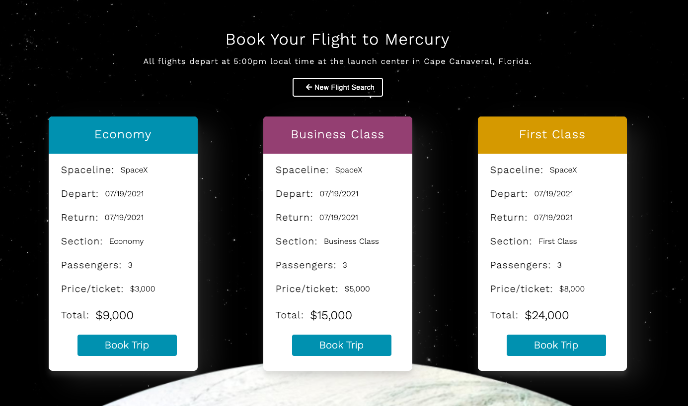

# Galaxy Getaways

## Description
  
Galaxy Getaways is a full-stack MERN application where users can sign-up, login, and 'book' flights to different planets in our solar system. Users are able to choose from different seat types, view their upcoming trips, and cancel their trips if desired. 

## Functionality

* Users must create an account and login to access the homepage form to book a trip.
* Once logged in, users gain access to the book-a-trip form and My Trips page.

## Key NPM Packages Used

* jsonwebtoken
* mongoose
* react-router-dom
* bcrypt
* express
* axios
* react-number-format
* react-date-picker
* react-moment

## Installation

1) Open your terminal and install dependencies with:

        npm install

2) Update the .env.EXAMPLE file with your JWT secret, and remove '.EXAMPLE' from the file name. 
4) Run the following seed command in your terminal to add seed users and trips:
        
        npm run seed

5) Start the local server and open localhost:3000 in your browser:

        npm start

## Live App

Link to the live Heroku application is [here](https://galaxy-getaways.herokuapp.com/).

## Credits

[Scott Strittmatter](https://github.com/mrpancakes) | [Nate Griggs](https://github.com/nateghsc09) | [Emily Metzgar](https://github.com/emilymetzgar)

## License

Copyright (c) [2021] [Scott Strittmatter, Nate Griggs, Emily Metzgar SMU Coding Bootcamp]

Permission is hereby granted, free of charge, to any person obtaining a copy
of this software and associated documentation files (the "Software"), to deal
in the Software without restriction, including without limitation the rights
to use, copy, modify, merge, publish, distribute, sublicense, and/or sell
copies of the Software, and to permit persons to whom the Software is
furnished to do so, subject to the following conditions:

The above copyright notice and this permission notice shall be included in all
copies or substantial portions of the Software.

THE SOFTWARE IS PROVIDED "AS IS", WITHOUT WARRANTY OF ANY KIND, EXPRESS OR
IMPLIED, INCLUDING BUT NOT LIMITED TO THE WARRANTIES OF MERCHANTABILITY,
FITNESS FOR A PARTICULAR PURPOSE AND NONINFRINGEMENT. IN NO EVENT SHALL THE
AUTHORS OR COPYRIGHT HOLDERS BE LIABLE FOR ANY CLAIM, DAMAGES OR OTHER
LIABILITY, WHETHER IN AN ACTION OF CONTRACT, TORT OR OTHERWISE, ARISING FROM,
OUT OF OR IN CONNECTION WITH THE SOFTWARE OR THE USE OR OTHER DEALINGS IN THE
SOFTWARE.